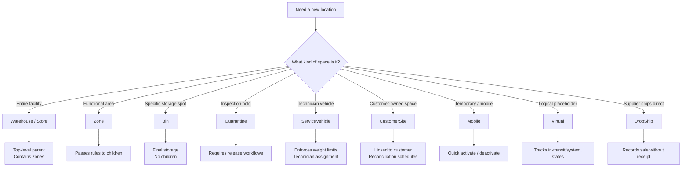

# Chapter 1: Understanding Inventory Locations

**Contract Reference:** `foundation/inventory-locations/`

## The Living Map of Your Warehouse

Walk into a warehouse for the first time and you'll see rows of shelves, loading docks, and workers moving with purpose. Without a map, you'd be lost. But what if your map could do more than show where things are? What if it could warn you when a zone is getting crowded, remember which areas need special handling, and help you find the best place to store incoming goods?

That's what the Inventory Locations system does. It transforms your physical spaces—warehouses, stores, service vehicles, even customer sites—into an intelligent map that doesn't just track where everything is, but understands how your operation works.

Think of the difference between a paper map and GPS. The paper map shows roads; GPS knows traffic patterns, suggests better routes, and warns about delays. Your inventory locations work the same way—they're not just addresses, they're spaces that help you make better decisions every day.

::: info
**Before You Start**
- Review your master location naming convention so search, RF devices, and analytics stay aligned.
- Gather the operational facts: temperature requirements, hazardous materials flags, max pallet heights, and ownership rules.
- Confirm who approves new locations (ops lead, facilities, compliance) so the creation workflow does not stall partway through.
:::

::: danger
**Common Pitfalls**
- Copying an existing bin type without checking inherited rules (e.g., quarantine, temperature) leads to surprise blocking later.
- Leaving utilization thresholds at defaults can swamp staging areas during seasonal spikes.
- Forgetting to document why a location was created makes future audits painful—capture the business trigger in the notes right away.
:::

## Scenario: Expansion Week in Receiving

> Goal: Open a new receiving zone, shift overflow inventory, and keep auditors happy during the busiest week of the quarter.

**Monday 08:00 — Facilities Walkthrough**
- Floor lead tours an empty corner of the warehouse slated for expansion.
- Notes special requirements: cold chain pallets, temporary contractor staging, and lift-clearance limits near sprinkler lines.

**Monday 09:30 — Location Design Workshop**
- In Smackdab > Locations, clone an existing refrigerated zone but adjust capacity to 65 pallet positions.
- Add child bins for “Dock A – Cold Hold” and “Dock A – QA Review” with quarantine rules enabled.

**Monday 11:00 — Approval + API Sync**
- Ops lead approves the new zone; platform engineer calls the Locations API to push the structure to downstream integrations.
- Warehouse automation tooling is notified through the event feed (`inventory.location.created`), so pick/put-away algorithms start considering the new zone.

**Monday 14:00 — Controlled Go-Live**
- Team freezes the old overflow zone, activates the new bins, and re-routes inbound ASN appointments.
- Capacity dashboard shows the new zone trending at only 20% utilization while legacy receiving burns down to 60% by end of day.

**Tuesday 07:30 — Audit Check-In**
- Compliance officer views the timeline of freeze/unfreeze events plus audit notes captured in the location history—no manual spreadsheet required.

## Location Type Cheat Sheet

| Type | Ideal For | Key Rules | Watch Outs |
| --- | --- | --- | --- |
| Warehouse / Store | Top-level facilities | Holds child zones, tracks SLA targets | Cannot sit inside another location |
| Zone | Functional areas (Receiving, QA, Staging) | Inherits/propagates rules to children | Wrong type breaks bin hierarchy |
| Bin | Final storage positions | Tracks capacity, cycle counts, inventory states | Set correct UOM and dimensions |
| Quarantine | Holds pending inspections | Blocks picking/put-away until cleared | Requires reason + release workflow |
| Service Vehicle | Technician vans, mobile inventory | Enforces technician assignment, weight limits | Use alerts to restock before routes |
| Customer Site | Consignment/VMI locations | Links to customer account and billing cadence | Needs reconciliation schedule |
| Virtual | In transit, pending receipt | Keeps inventory visible without a physical slot | Do not leave inventory stranded here |

### Quick Confidence Check

<LearningQuiz
  question="Why is picking the correct location type so important?"
  :options="[&quot;The type controls hierarchy, permissions, and operational rules&quot;, &quot;It changes the color of the bin in the mobile app&quot;, &quot;It guarantees the location never needs maintenance again&quot;]"
  :answer-index="0"
  :explanations="[&quot;Types drive how the system treats the location.&quot;, &quot;Color themes are unrelated to location behavior.&quot;, &quot;Maintenance is still required over time.&quot;]"
/>

---

## API Blueprint: Create a Location Programmatically

When automations or external systems need to seed a new location, call the contract-first API. The example below mirrors the scenario above and can be pasted into your sandbox runner.

```http
POST /operations/locations/v1/locations
Content-Type: application/json

{
  "code": "REC-A-COLD",
  "name": "Receiving Zone A - Cold",
  "type": "ZONE",
  "parentCode": "WH-MAIN",
  "capacity": {
    "unit": "PALLET",
    "max": 65
  },
  "rules": {
    "temperatureRangeCelsius": { "min": 0, "max": 4 },
    "quarantineRequired": true,
    "receiving": { "dockDoor": "A", "asnOnly": true }
  },
  "notes": "Expanded cold receiving capacity for Q4 peak. Audit ref: FAC-2025-11."
}
```

```bash
curl -X POST https://api.smackdab.app/operations/locations/v1/locations \
  -H "Authorization: Bearer <token>" \
  -H "Content-Type: application/json" \
  -d @payload.json
```

The response returns the location ID plus derived metadata (hierarchy path, utilization thresholds) so you can sync downstream systems.

## Practice Lab: Map Your Own Facility

#### Launch the guided lab

1. Open the sandbox environment and duplicate the “Main DC” warehouse.
2. Add a new **Zone** named “Lab Staging” with capacity of `20` pallets and a utilization warning at `70%`.
3. Create two **Bins** under the zone:
   - `LAB-STAGE-01` (standard, 110" height clearance)
   - `LAB-HAZ-01` (quarantine enabled, requires hazmat certification)
4. Freeze `LAB-HAZ-01`, add a note explaining the mock inspection, and set auto-unfreeze in 2 hours.
5. Use the **Inventory Rollup** tool to confirm the zone reports `0` capacity usage but shows the freeze reason in the hierarchy.
6. Capture a screenshot of the rollup and attach it to your runbook—this becomes your “done” proof.

Try variations: convert `LAB-STAGE-01` into a service vehicle, or simulate a transfer to test how alerts behave.

## Getting Started: Adding Your First Location

Let's start with the basics: creating a new location.

**To add a location:**

1. **Name it clearly** — Use names that make sense to your team. "Zone A - Receiving" is better than "ZN-001." Workers should know exactly what you mean when you say the name out loud.

2. **Give it a code** — This is the short identifier your scanners will use. Keep it simple and memorable: "A-RCV" or "BIN-A-47." Codes should be easy to type and hard to confuse. Avoid codes that look similar (like "O" and "0" or "I" and "1").

3. **Choose a type** — This is critical because the type determines what the system allows and enforces.

   **Warehouse or Store** — Your main building or retail location, the top of your location tree. Use this for "Main Distribution Center" or "Retail Store #5." This allows child locations (zones, bins) but can't be nested inside anything. If you mistakenly make a zone a warehouse, you can't nest it properly and your hierarchy breaks.

   **Zone** — A major functional area inside a facility, like a "department" within your warehouse. Use this for "Receiving," "Shipping," "Cold Storage," "Hazmat Area," or "Returns Processing." Zones sit inside warehouses, can contain bins or aisles, and inherit/pass down rules to children. If you make a bin a zone, you'll try to put other bins inside it and create confusion about capacity.

   **Bin** — The actual physical spot where inventory sits: a shelf, pallet position, or rack location. This is the final destination for storing items, like "Bin A-47" or "Pallet Rack 12-C." Bins hold inventory directly, can't contain other locations, and track exact quantities. If you make a zone a bin, you can't divide the space further when needed.

   **Quarantine** — A holding area where items wait for inspection, approval, or investigation before moving. Use this for returns processing, quality holds, damaged goods inspection, or receiving inspection areas. The system automatically blocks items from leaving without approval, requires inspection workflows, and flags items as "on hold." If you use a regular bin instead, items can leave freely without inspection and you lose quality control.

   **Service Vehicle** — A truck, van, or vehicle that carries inventory to job sites with a specific technician. Use this for field service operations where technicians carry parts and supplies. The system requires technician assignment, enforces weight/volume limits, restricts access to the assigned technician only, and tracks mobile inventory. If you use a regular bin, anyone can access the inventory and you lose control over who has what in the field.

   **Customer Site** — A location at your customer's facility where you store inventory you still own. Use this for consignment inventory, vendor-managed inventory (VMI), or equipment installed at customer locations. The system links to customer records, requires reconciliation schedules, tracks inventory separately from your warehouse, and may trigger billing when used. If you use a regular warehouse, you can't track which customer has what, making billing and reconciliation impossible.

   **Mobile** — Temporary or moving locations without fixed addresses. Use this for pop-up distribution points, temporary event inventory, or construction site storage. These allow flexible addressing, may not require full hierarchy, and can be activated/deactivated quickly. If you create a permanent warehouse for temporary sites, you'll clutter your system with inactive locations.

   **Virtual** — A logical location that doesn't physically exist, used for accounting or system purposes. Use this for "In Transit," "Pending Receipt," "Awaiting Transfer," or "Write-Off" locations. These hold inventory in the system without physical space, bridging inventory states between physical locations. If you try to put real inventory here, workers can't find it physically—it exists only in the system.

   **Drop Ship** — A virtual location representing inventory that ships directly from supplier to customer, never touching your warehouse. Use this for tracking orders where the supplier ships directly to your customer. The system records the transaction without requiring receiving or shipping from your facility and updates inventory as "sold" without ever showing "in stock." If you use a regular warehouse, you'll try to physically receive items that never arrive.

   **Decision guide:** Start with your building (Warehouse/Store), divide it into areas (Zone), create storage spots (Bin). Need inspection holds? Use Quarantine. Tracking tech vans? Use Service Vehicle. Storing items at customer locations? Use Customer Site. Need placeholders for in-transit items? Use Virtual.



   The type locks in certain behaviors. You can't convert a service vehicle into a regular bin without emptying it and removing the technician assignment. Choose correctly from the start.

4. **Select a parent** — Where does this location live? A bin goes inside a zone, a zone goes inside a warehouse. This creates your hierarchy. The parent determines what rules your new location inherits. If you put a frozen bin inside a room-temperature zone, you'll create conflicts. Match the parent's characteristics or plan to override them explicitly.

5. **Set capacity** — This tells the system how much the location can hold and when to warn you.

   **Total capacity** defines the maximum the location can hold. Choose a unit that makes sense: **Pallets** for large storage areas ("Zone A can hold 50 pallets"), **Cubic feet/meters** for oddly-shaped spaces or mixed storage, **Units** for small bins storing individual items ("Bin holds 200 units"), or **Weight** for vehicles or locations with weight limits ("Service van: 2,000 lbs max"). The system calculates utilization percentages based on this number. If you say a bin holds 100 units but it actually holds 50, the system will show 50% full when it's actually maxed out—so measure accurately.

   **Warning thresholds** tell the system when to alert you:

   **Warning level (typically 75%)** means "pay attention—this location is getting full." A yellow indicator appears and the location shows in "needs attention" lists. Set this early enough to take action before it becomes urgent. Fast-moving staging areas might warn at 85%; slow-moving storage might need attention at 60%.

   **Critical level (typically 90%)** means "take action now—space is running out." You'll see a red indicator, notifications go to supervisors, and the location appears in priority alerts. This is the point where you need to actively manage the situation. If items rarely leave, set this lower; if items move fast, you can run hotter.

   **Maximum level (typically 95%)** means "hard stop—don't add more without removing something." The system may block new receipts, automated processes skip this location, and you'll need an override to use it. Why not 100%? Leave room for operational reality—pallets don't stack perfectly, measurements aren't exact. Service vehicles might use 100% (weight limits are firm), but flexible storage might use 90% (you need working room).

   **Example setups:**
   - Receiving staging (fast flow): 85% warning, 95% critical, 98% max
   - Long-term storage (slow flow): 60% warning, 80% critical, 90% max
   - Service vehicle (hard limit): 70% warning, 90% critical, 100% max

6. **Mark the status** — This controls what operations are allowed.

   **Active** means normal operations—everything is allowed. You can receive inventory, pick items, transfer in/out, count, and adjust. This is your default for operational locations.

   **Inactive** means the location exists but isn't in use right now. It blocks all movements and hides from most searches unless you specifically look for inactive locations. Use this for seasonal areas during off-season, locations being cleaned/repaired but not under audit, or areas you're not currently staffed to manage. Inactive is temporary (you plan to use it again); Archived is permanent.

   **Receive Only** means inventory can come in but nothing can be picked out. You can receive shipments and transfers in, but you can't pick for orders or transfer out. Use this when building up stock in a new zone before it goes live, in holding areas where you accumulate items before moving them all at once, or when transitioning a location to inactive (clear it by blocking new receipts).

   **Pick Only** means inventory can go out but nothing new can come in. You can pick for orders and transfer out, but you can't receive new shipments or transfer in. Use this when clearing out a zone you're shutting down, phasing out locations (let them empty naturally), or managing areas under capacity pressure (stop adding, start removing).

   **Frozen** means completely locked—nothing in or out. All movements are blocked and you need an explicit unfreeze to use it again. Use this for cycle counts/audits, quality investigations, awaiting inspection approval, or maintenance/repairs in progress. You can set automatic expiration: "Freeze until 5 PM today" or "Freeze for 24 hours."

   **Quarantine** (status, not to be confused with Quarantine type) means items are on hold pending approval. Items can enter but require approval workflow to leave. Use this for returns processing, damaged goods investigation, or quality holds. Unlike Frozen (which blocks everything), Quarantine allows managed releases with approval.

   **Archived** means the location is retired and removed from active operations. It's hidden from all normal operations, can't receive inventory, and is preserved for historical reporting only. Use this for permanently closed locations, reorganized areas that no longer exist, or old customer sites you no longer service. Inactive means "not using now, will use later"; Archived means "done with this, probably forever."

   **Quick decision guide:** Normal operations → Active. Temporarily not in use → Inactive. Building stock before release → Receive Only. Clearing out an area → Pick Only. Counting or investigating → Frozen. Items need approval to leave → Quarantine. Done forever → Archived.

**Why this matters:** When you nest a bin inside a refrigerated zone, it automatically inherits the temperature requirements. You set the rule once at the zone level, and every location inside follows it. This inheritance saves configuration time and ensures consistency—you don't have to remember to set temperature requirements on every single bin.

---

## Understanding the Hierarchy

Every location has a family tree. Instead of scrolling a wall of rows, think in terms of levels:

| Level | Example | What Inherits Downstream | When to Drill In |
| --- | --- | --- | --- |
| Warehouse / Store | `Main Warehouse` | Global policies, SLA targets, facility alerts | Facility-level capacity, cross-dock enablement |
| Zone | `Receiving Zone`, `Cold Storage Zone` | Temperature ranges, certification requirements, automation toggles | Spot congestion or enforce special handling |
| Sub-Zone / Area | `Staging Area`, `QA Hold` | Task routing, put-away rules | Manage micro-flows within a zone |
| Bin | `BIN-A-47`, `PALLET-ROW-03` | Capacity, cycle count frequency | Confirm what is physically there |

Breadcrumbs at the top of each location (for example, `Main Warehouse > Receiving Zone > Staging Area > BIN-A-47`) are live links—use them to jump levels instantly.

::: tip Hierarchy Pro Moves
- **Set rules once:** apply temperature or hazmat flags at the zone and let all bins inherit them. No more mismatched settings.  
- **Watch rollups:** when a zone spikes to 90% utilization, you already know every bin inside needs help.  
- **Guard access:** certification requirements live on the zone; anyone scanning a child bin sees the same warning.  
- **Stay organized:** group alike-with-alike so audits and training stay intuitive.
:::

#### Move-with-Confidence Workflow

1. Open the location, choose **Move**.  
2. Search or navigate to the intended parent.  
3. Use the compatibility preview—temperature, ownership, hazard rules must align.  
4. Confirm. The system prevents circular references or unsafe moves automatically.

#### Hands-on: Rehome a Bin Safely

1. In sandbox, open `BIN-STAGE-05`.  
2. Attempt to move it into `Dry Storage Zone`—note the cooling rule mismatch warning.  
3. Cancel and instead select `Cold Storage Zone` where the rule matches.  
4. Confirm the move, then open the zone to ensure the bin now inherits the cold-storage automation.

### Quick Confidence Check

<LearningQuiz
  question="You clone a refrigerated bin into a standard zone. What happens when you try to save?"
  :options="[
    'The move is blocked because temperature rules conflict',
    'The system silently converts the zone to refrigerated',
    'The bin keeps its cold rules while the zone stays ambient'
  ]"
  :answer-index="0"
  :explanations="[
    'Hierarchy validation stops unsafe moves before they go live.',
    'Zones never auto-convert; edits are explicit.',
    'Children cannot enforce rules the parent forbids.'
  ]"
/>

---

## Finding Locations Quickly

| Shortcut | When to Use | What You Get Back |
| --- | --- | --- |
| Type `Bin A-47` | You know the code | Location card with status, utilization, parent path |
| Type `receiving zone` | Need a functional area | List of zones ordered by utilization + capacity indicators |
| Type `frozen < 50%` | Need space with conditions | Cold-storage zones/bins under 50% full and ready to use |
| Type `quarantine active` | Audit or inspection mode | All locations currently blocking picks, with reason + timer |

The search box accepts natural phrases (`"frozen storage less than 50% full"`) and prioritizes results that satisfy your intent. If you're about to store frozen goods, ambient zones automatically fall to the bottom.

::: tip Power Filters
- **Status** – isolate Active vs Frozen vs Archived to keep noisy results out.  
- **Type** – laser-focus on bins versus service vehicles.  
- **Capacity range** – find the Goldilocks zone (not empty, not overloaded).  
- **Parent** – spotlight every child under a problem zone instantly.  
- Combine them: *Active + Type=Bin + Parent=Receiving + Utilization > 80%* → the bins you must fix first.
:::

#### Try It: Build a “Hot Spots” View

1. Open Locations → Search, type `zone utilization > 80`.  
2. Add filters: **Type = Zone**, **Status = Active**.  
3. Sort by utilization descending and bookmark the results.  
4. During stand-up, pull this view to discuss load balancing plans.

### Quick Confidence Check

<LearningQuiz
  question="Which filter combo surfaces pick bins that are nearly full in Receiving?"
  :options="[
    'Status=Active, Type=Bin, Parent=Receiving Zone, Utilization >= 80%',
    'Type=Zone, Status=Archived, Utilization <= 20%',
    'Type=Service Vehicle, Status=Frozen'
  ]"
  :answer-index="0"
  :explanations="[
    'Those parameters zero in on busy receiving bins.',
    'Archived zones with low utilization are irrelevant for hot bins.',
    'Frozen service vehicles don’t help with receiving congestion.'
  ]"
/>

---

## Checking What's Stored Where

**One-click state view**
1. Open a location → **Inventory** tab.  
2. Review the state chips (Available, Allocated, In Transit, Reserved).  
3. Hover to see percentages vs total capacity and recent movement.

::: info Serial / Lot Tracking
If the item is serialized or lot-controlled, expand the row to view full traceability: serial number, lot code, expiration, and the last transaction on that unit. During recalls, filter by lot and jump straight to the responsible bin.
:::

**Own vs 3PL vs Customer**
- The ownership column shows who owns each quantity slice.  
- Click an owner to filter—critical when you operate consignment or VMI programs.  
- The system blocks cross-owner consumption, so use this view to reconcile before billing.

### Rollups When You Need the Big Picture

| You Want To Know | Use This | Why It Helps |
| --- | --- | --- |
| Inventory inside a zone | `Inventory Rollup` on the zone | Aggregates products across every child bin instantly |
| Category health | Group by **Category** | Compare fast movers vs slow movers without exporting |
| Units in different measures | Group by **UOM** | See pallets + cases + eaches simultaneously |
| Yesterday vs Today | Set the **As Of** timestamp | Investigate deltas, build audit trail |

#### Lab: Find the Missing 20 Units

1. Take note of current quantity in `Zone - Staging`.  
2. Switch **As Of** to yesterday 08:00.  
3. Compare: yesterday shows 120 units, today 100 units.  
4. Click the 20 unit delta to open the transaction list—spot the transfer that occurred overnight.  
5. Add a note in the investigation log linking to that transfer.

### Quick Confidence Check

<LearningQuiz
  question="How do you confirm who owns the stock before invoicing a customer site?"
  :options="[
    'Filter the ownership column in the inventory view',
    'Export the entire warehouse inventory to CSV',
    'Delete the inventory so ownership is zero'
  ]"
  :answer-index="0"
  :explanations="[
    'Ownership filtering keeps billing accurate and auditable.',
    'Exports are unnecessary for a simple ownership check.',
    'Deleting stock loses traceability and revenue.'
  ]"
/>

---

## Managing Capacity

Capacity is more than "full" or "empty." Think of it as a heartbeat you monitor continuously.

### Capacity Dashboard Checklist

- **Total capacity** – the maximum, in pallets / cubic units / weight.  
- **Current usage** – live occupied space.  
- **Reserved** – committed but not yet consumed.  
- **Utilization %** – the score everyone watches.  
- **Projected full date** – where trends are pointing.

::: warning Tune Alert Thresholds
1. Open the location → **Thresholds**.  
2. Set **Warning** (e.g., 75%) to cue “watch this.”  
3. Set **Critical** (e.g., 90%) to trigger action.  
4. Set **Max** (e.g., 95%) for a hard stop.  
5. Review after two weeks: too many false alarms? Nudge the numbers.
:::

| Location Type | Suggested Warning / Critical / Max | Why |
| --- | --- | --- |
| Fast-moving staging | 85% / 95% / 98% | Turnover is rapid—you can run hot |
| Long-term storage | 60% / 80% / 90% | Slow movement needs more buffer |
| Service vehicles | 70% / 90% / 100% | Weight limits are absolute |

### Trend Triage Playbook

- **Trend line climbing?** Check inbound schedule and overflow relationships.  
- **Rate of change > 4% per day?** Trigger proactive transfers before the rush.  
- **Projection shows critical within 48 hours?** Alert shift leads and reprioritize pick/put-away tasks.

#### Simulation: Stay Ahead of a Surge

1. On Tuesday 09:00, Receiving shows 70% utilization with +5% daily trend.  
2. Projection says 92% by Thursday 14:00.  
3. Enable overflow to Zone B and schedule extra outbound picks Wednesday morning.  
4. Re-run projection; if critical moves beyond 72 hours, your plan worked.

### Quick Confidence Check

<LearningQuiz
  question="Receiving is trending +6% per day and projected to hit 95% on Friday. What is the best proactive move?"
  :options="[
    'Activate overflow relationships and move freight out before Thursday',
    'Raise the maximum threshold to 110% so alerts stop firing',
    'Do nothing until it actually reaches 95%'
  ]"
  :answer-index="0"
  :explanations="[
    'Create space before the surge—overflow plus early shipments keeps flow moving.',
    'Thresholds above 100% remove safety margin and break controls.',
    'Waiting guarantees congestion and emergency scrambling.'
  ]"
/>

---

## Freezing and Unfreezing Locations

Sometimes you need to pause a location temporarily—cycle counts, inspections, maintenance.

### Freeze Playcard

1. Open location → **Freeze**.  
2. Choose a reason (required).  
3. Set auto-unfreeze (date/time).  
4. Confirm.

**System impact immediately**
- Receipts + picks blocked.  
- Automation skips the frozen node.  
- Scanners display the reason and release time.  
- Status chips and search results show a freeze badge.

::: tip Auto-Unfreeze FTW
Avoid sticky freezes by always setting an expiration (“Unfreeze at 17:00” or “Freeze for 4 hours”). The system restores the previous status automatically.
:::

#### API Quick Hit

```http
POST /operations/locations/v1/locations/{locationId}/freeze
{
  "reason": "Cycle count in progress",
  "releaseAt": "2025-10-15T17:00:00Z"
}
```

```http
POST /operations/locations/v1/locations/{locationId}/unfreeze
{
  "note": "Count complete, variances recorded"
}
```

### When to Freeze

- **Cycle counting** – lock movement so counters get a clean snapshot.  
- **Quality investigations** – hold suspect stock until QA clears it.  
- **Regulatory audits** – keep inspectors happy and evidence tidy.  
- **Maintenance** – protect goods during repairs or sanitation.

Freezing at the zone level cascades to every child—ideal when an entire area needs a pause.

> **Case Study:** During a ceiling repair, Zone C was frozen for four hours. The system rerouted inbound ASNs to overflow, RF scanners displayed “Frozen – Ceiling repair until 15:00,” and once the auto-unfreeze triggered, operations resumed with no lost pallets or frantic calls.

### Quick Confidence Check

<LearningQuiz
  question="What is the safest way to unfreeze after a maintenance window?"
  :options="[
    'Let the auto-unfreeze release and add a completion note',
    'Delete the location and recreate it so it is clean',
    'Start moving pallets in before unfreezing to save time'
  ]"
  :answer-index="0"
  :explanations="[
    'Auto-unfreeze keeps history intact and notes explain the release.',
    'Deleting erases history and breaks references.',
    'Moving inventory while frozen defeats the point of the control.'
  ]"
/>

---

## Archiving and Activating Locations

When you reorganize or close seasonal areas, you need to retire locations without losing their history.

### Archive Decision Tree

1. **Is there inventory left?**  
   - Yes → move or adjust inventory first.  
   - No → proceed.
2. **Is this a temporary pause?**  
   - Yes → mark **Inactive** instead.  
   - No → continue.  
3. **Do you need historical reporting?**  
   - Yes → archive.  
   - No → still archive (never delete, history matters).

::: info Archive Workflow
1. Ensure the location is empty.  
2. **Archive** → add a reason (`"Seasonal zone closed Q1"`).  
3. Location disappears from daily searches, blocks new inventory, but history stays intact.
:::

Need it back? Enable **Show Archived**, open the record, click **Activate**, choose the new status, and add a comeback note (e.g., `"Reopening for holiday surge"`).

| Status | When to Use | Visibility | Movement Allowed |
| --- | --- | --- | --- |
| Active | Normal operations | Everywhere | All |
| Inactive | Short pause, will return soon | Hidden unless filtered | None |
| Frozen | Temporary lock for audits/maintenance | Visible with freeze badge | None |
| Archived | Retired, keep history | Hidden unless archived filter | None |

### Quick Confidence Check

<LearningQuiz
  question="You’re closing a seasonal zone for six months with zero stock remaining. What’s the right status?"
  :options="[
    'Archive it with a note describing the closure',
    'Delete the zone so reports stay short',
    'Leave it active and hope nobody uses it'
  ]"
  :answer-index="0"
  :explanations="[
    'Archiving keeps history clean and removes it from daily workflows.',
    'Deleting erases audit trails.',
    'Leaving it active invites mistakes.'
  ]"
/>

---

## Labels and Barcodes

Labels and barcodes connect your digital system to the physical world. They're how workers interact with locations using scanners.

### Label Template Gallery

| Template | Use It For | Highlights |
| --- | --- | --- |
| Standard Bin | Everyday storage bins | Code, name, capacity, parent zone |
| Hazmat | Dangerous goods | PPE icons, hazard class, hotline |
| Customer Site | VMI / consignment | Customer info, contact, reconciliation cadence |
| Service Vehicle | Technician vans | Vehicle ID, technician, weight limit |

Preview templates from the **Labels** tab—what you see is exactly what prints.

#### Quick Print (Single)
1. Open location → **Labels**.  
2. Pick a template, adjust printer/material if needed.  
3. **Preview**, then **Print**.  
4. Stick it on the physical location, scan once to verify.

#### Batch Print (Many)
1. **Batch Labels** → select locations (by list, zone, or filtered search).  
2. Choose template + printer/material.  
3. Preview (optional), confirm.  
4. Monitor the batch job (queued → printing → complete). Reprint any failures from the job log.

::: info Barcode Formats
- **Code 128** – high-density, standard for bins.  
- **Code 39** – simple legacy support.  
- **QR / Data Matrix** – pack extra data for customer sites or vehicles.
:::

#### Generate Barcodes in Bulk

1. Go to **Batch Barcodes**.  
2. Select the target locations.  
3. Choose format (Code 128 for bins, QR for sites).  
4. Generate → track job status.  
5. Download the summary to hand off to the print room.

#### Troubleshooting Checklist
- Use **Barcode History** to see who generated which code and when.  
- If scans fail, verify the format matches your scanners.  
- Reprint from history if the label is damaged or replaced.

### Field Play: Stand Up a New Zone

1. Create 50 bins under the new zone.  
2. Batch print **Standard Bin** labels.  
3. Batch generate **Code 128** barcodes.  
4. Install labels, scan each bin to confirm.  
5. Capture the batch job summary and attach it to the deployment ticket.

Total time ~30 minutes versus hours manually.

---

## Connecting Locations Through Relationships

Locations often work together. Relationships tell the system how they coordinate and automate flows between them.

| Relationship | What it Connects | Trigger | Automation Outcome |
| --- | --- | --- | --- |
| Replenishment | Pick bin → bulk storage | Bin below threshold | Auto transfer tasks keep pick face stocked |
| Overflow | Primary zone → backup zone | Utilization above threshold | Redirects inbound loads, backfills later |
| Cross-Dock | Receiving → Shipping | Incoming tagged as cross-dock | Skips put-away, creates immediate outbound tasks |
| Adjacency | Neighboring bins/zones | Path planning | Optimizes walk sequences for picks/put-away |
| Hazard Buffer | Incompatible storage areas | Hazard rules | Prevents unsafe adjacency, raises alerts |

#### Replenishment in Action

1. Open pick bin (`PICK-A12`) → **Relationships** → **Add**.  
2. Select **Replenishment** and choose bulk location (`BULK-RACK-5`).  
3. Direction = source → target. Priority = 1.  
4. Rules: Trigger below 20%, fill to 80%, allow partial, no approval.  
5. Automation = Enabled.  
6. Confirm.

Now when `PICK-A12` drops under 20%, a transfer task fires automatically and the bin refills to 80%. You focus on coaching, not micromanaging bin levels.

#### Overflow Safety Net

1. Open `Receiving Zone A` → **Relationships** → **Add**.  
2. Choose **Overflow** and target `Receiving Zone B`.  
3. Threshold = 85%, release when back below 60%.  
4. Enable mirror-backfill so overflow drains automatically when space returns.

::: danger Hazard Buffers Save Lives
Link flammables and oxidizers with a Hazard Buffer. If someone tries to move incompatible pallets together, the system blocks the transfer and raises an alert. Document the reason so audits see the control in action.
:::

### Quick Confidence Check

<LearningQuiz
  question="Your pick bins keep running dry overnight. Which relationship solves it long term?"
  :options="[
    'Replenishment from the bulk rack with an automated trigger',
    'Hazard buffer between the bins and the bulk rack',
    'Cross-dock between receiving and the pick bins'
  ]"
  :answer-index="0"
  :explanations="[
    'Automated replenishment keeps the pick face healthy.',
    'Hazard buffers control safety spacing, not restock flow.',
    'Cross-dock skips put-away; it doesn’t restock pick bins.'
  ]"
/>

> **Pro tip:** Use the relationship matrix view to audit all links at once. Look for missing overflow paths or dormant replenishment rules that need a tune-up before peak season.

---

## Tracking Performance

Performance metrics turn locations from static spaces into assets you can optimize.

### Performance Control Panel

| Metric | What It Means | Watch For | Action |
| --- | --- | --- | --- |
| Throughput | Movements in/out | Sudden drops or spikes | Check status changes, replenishment rules |
| Utilization | Average space used | Persistently low (<30%) or maxed (>95%) | Resize, repurpose, or add capacity |
| Dwell Time | How long stock stays | Rising dwell in fast lanes | Investigate slow sales or blocked picks |

#### Launching Analysis
1. Open **Location Performance**.  
2. Pick a date range (last week, last month, custom).  
3. Choose your scope (specific IDs, entire zone, type filter).  
4. Group by location, zone, or parent hierarchy.  
5. Toggle **Trend View** to see time-series patterns.

::: tip Compare Like-for-Like
Select multiple bins from the same zone to spot outliers quickly. A bin with 10× the throughput might have the wrong product or priority.
:::

### Spotlight Scenarios

- **Throughput slump:** Zone B drops 20%. The dashboard shows bins marked “Pick Only”—re-enable replenishment, throughput rebounds.  
- **Dwell spike:** Pick Bin C-15 climbs from 3 → 7 days. Alert sales, reduce forward stock, shift the slot to a faster mover.  
- **Fleet imbalance:** Service Vehicle 5 runs at 98% while Vehicle 7 cruises at 40%. Reassign technicians or inventory to balance load.

#### Export + Share

Use the export button for executive decks, BI mashups, or year-over-year comparisons. Include trend charts in your ops review to show where proactive actions paid off.

### Quick Confidence Check

<LearningQuiz
  question="Dwell time is climbing in your staging zone. What is the first question to ask?"
  :options="[
    'Are outbound shipments or put-away tasks backing up?',
    'Should we delete the zone to reset the metric?',
    'Can we ignore it because dwell doesn’t matter?'
  ]"
  :answer-index="0"
  :explanations="[
    'Backlog in downstream processes usually drives dwell spikes.',
    'Deleting destroys history and causes chaos.',
    'Dwell is a leading indicator—you should never ignore it.'
  ]"
/>

---

## Search and Mass Operations

When you need to find or change many locations at once, advanced search and mass operations save enormous time.

### Advanced Search Builder

1. Open **Location Search**.  
2. Add filters:
   - **Status** (Active, Frozen, etc.)  
   - **Type** (Bin, Zone, Vehicle…)  
   - **Parent** (focus on a zone hierarchy)  
   - **Utilization range** (e.g., 70–90%)  
   - **Tags/Zones** if your org tracks them  
3. Run the search and review the results grid with live utilization, alerts, and relationship indicators.

Search is the staging ground for every mass update: get the right list first, then take action.

### Mass Update Safety Net

1. From the search results, click **Mass Update**.  
2. Confirm the selection (add/remove IDs as needed).  
3. Choose the update: status, thresholds, attributes, alerts, etc.  
4. Click **Preview**.

Preview shows:
- The exact locations impacted.  
- Old vs new values.  
- Inventory affected.  
- Warnings (e.g., cannot change because of pending transactions).

Only after the preview looks right do you **Execute**. The system creates a job so you can track progress.

::: tip Track the Job
- Use the job detail page to watch completion, errors, retries.  
- Export the change log for audit records.  
- Re-run the job if any records fail—only the failures reprocess.
:::

#### Mass Update Lab

1. Search for all **Cold Storage** bins.  
2. Mass update warning thresholds from 75% → 70%.  
3. Preview: confirm 42 locations, note utilization impact.  
4. Execute, then open job history to download the change report.  
5. Attach the report to your facilities ticket for compliance.

### Quick Confidence Check

<LearningQuiz
  question="Why is the preview step non-negotiable before executing a mass update?"
  :options="[
    'It shows the exact impact and catches conflicts before you commit',
    'It slows you down so you feel more careful',
    'It is optional because undo is automatic'
  ]"
  :answer-index="0"
  :explanations="[
    'Preview is your audit trail and safety harness.',
    'Speed without accuracy creates bigger problems.',
    'There is no global undo—preview prevents mistakes.'
  ]"
/>

---

## Bringing It All Together: A Day in the Life

Let me show you how all these capabilities work together in a real operational day.

**Monday, 7:00 AM — Tom, Receiving Manager**

Tom starts his day by checking location capacity. He opens the capacity dashboard and sees Receiving Zone A at 68%—comfortable for now. But three large shipments arrive today. He checks the trend: climbing 5% per day means he'll hit 83% by end of day. Tomorrow's shipments would push him to 95%.

Tom sets up an overflow relationship: Receiving Zone A → Overflow Zone C, trigger at 80%. Now if Zone A hits 80%, incoming shipments automatically route to Overflow Zone C. Problem solved proactively.

**Monday, 9:30 AM — Lisa, Quality Manager**

A batch of returned items arrived Friday and sat in Bin D-123 over the weekend. Lisa needs to inspect them before they can be restocked or scrapped.

She opens Bin D-123, clicks "Freeze," adds reason: "Return inspection - quality hold." She sets automatic unfreeze for 5 PM today (she knows inspection will be done by then). Now workers can't accidentally pick from this bin or add more items to it. Her inspection team can work without interruption.

**Monday, 11:45 AM — Marcus, Picker**

Marcus is picking orders. He scans a bin in the electronics zone (Bin E-42). His scanner immediately displays:
- Location: Bin E-42, Electronics Zone
- Status: Active
- Special requirements: ESD gloves required, high-value area, QC scan before shipping
- Current stock: 47 units available

He doesn't need to remember which bins require ESD gloves—the location tells him. He grabs the gloves, picks the items, scans them for QC, and moves on.

**Monday, 1:15 PM — Janet, Operations Manager**

Janet reviews weekly performance metrics. She notices Zone B's throughput dropped 20% last week. That's unusual—Zone B is normally one of the busiest.

She drills down to individual bins in Zone B. Three bins show zero throughput, which is suspicious. She opens those bins and sees they're marked "pick-only" status. That's wrong—they should be active (both receiving and picking).

She uses mass update:
1. Selects the 3 problem bins
2. Changes status from "pick-only" to "active"
3. Previews (confirms only 3 bins change)
4. Executes

The 3 bins immediately start accepting replenishment again. Zone B's throughput will return to normal.

**Monday, 3:00 PM — Tom, Receiving Manager (continued)**

The third large shipment of the day arrives. Receiving Zone A is now at 82%. The overflow relationship Tom set up this morning kicks in automatically. The system directs this shipment to Overflow Zone C. Workers see on their tablets: "Zone A at capacity, use Zone C per overflow rule."

They take the shipment to Zone C, scan it in, and everything tracks correctly. No confusion, no bottlenecks, no supervisor scrambling to find space.

**Monday, 5:00 PM — Lisa, Quality Manager (continued)**

Lisa's inspection of Bin D-123 is complete. The items are fine—they can be restocked. She doesn't need to manually unfreeze the bin because she set automatic unfreeze for 5 PM. The bin automatically returns to active status. Workers can now restock or pick from it.

Lisa checks her notes: of the 30 returned items, 28 are good for resale, 2 need scrapping. She creates an adjustment for the 2 damaged units, documenting the reason. The adjustment reduces inventory by 2, and the transaction references the inspection freeze for audit trail purposes.

**Monday, 5:30 PM — Tom, Receiving Manager (wrap-up)**

Tom reviews the day. Receiving Zone A ended at 83%—right where he projected. Overflow Zone C has 4 pallets from this afternoon's shipment. Tomorrow morning, his team will move them back to Zone A as space opens up (or the overflow relationship will automatically trigger transfers).

He checks the replenishment relationships for pick bins. All good—pick bins are restocking automatically overnight. Tomorrow morning, pickers will have fresh stock.

He approves a mass update job that warehouse supervisor Sarah submitted: relabeling 25 bins in Zone D after reorganization. The preview looks correct (25 bins, no inventory impact, just new labels and barcodes). He clicks "Execute." The batch print job runs, labels print, and tomorrow workers will apply the new labels.

**End of day:**

The warehouse processed three large shipments without congestion. Quality inspections happened without disrupting operations. Pickers had the information they needed right when they scanned bins. An operations issue was identified and fixed in minutes. Everything tracked correctly, and audit trails are complete.

The location system orchestrated all of this, turning what could have been a chaotic Monday into smooth operations.

---

## Common Questions & Troubleshooting

### "Why can't I move items to this location?"

When the system prevents using a location, it's protecting you from problems. The location might be frozen for inspection, at maximum capacity, or designated for different product types. Instead of forcing items into the wrong place and creating problems later, the system stops you and explains why.

Check the location's status—is it frozen or inactive? Check capacity—is it at maximum? Check any special requirements—does it require certain product types or handling? The system tells you the specific reason. Fix that issue and you can use the location.

### "What does the warning symbol mean?"

Warning symbols are like a check-engine light—something needs attention before it becomes a problem. A yellow triangle might mean approaching capacity. A thermometer might indicate temperature requirements aren't being met. A clock might show the location hasn't been counted recently.

These aren't emergencies. They're the system saying, "You might want to look at this." Address warnings during slower periods to prevent urgent issues during busy times. Open the location to see the specific warning and recommended action.

### "How do I choose the right location type?"

Think about what the space does physically. A building = Warehouse. A major area inside = Zone. An individual storage spot = Bin. Items waiting for inspection = Quarantine. A tech's van = Service Vehicle. Inventory at a customer's facility = Customer Site. Placeholder for in-transit items = Virtual.

The type determines what rules the system enforces. Choose based on real-world function, not just convenience. If you're not sure, start with the closest match and test it. Changing types later is possible but requires emptying the location first.

### "Why do some locations have relationships and others don't?"

Not every location needs relationships—just locations that work together regularly. A pick face and its bulk storage backup need a replenishment relationship because they coordinate inventory flow. A main zone and its overflow need that connection. But a standalone long-term storage bin that rarely interacts with others? It's fine without relationships.

Add relationships when locations need to coordinate automatically, not just because the feature exists. Too many relationships create complexity without value.

### "What happens when I archive a location?"

Archiving removes the location from daily operations but preserves all history. The location disappears from normal searches and lists. It can't accept new inventory. But historical data remains intact—you can still see what was stored there last year, run reports that include it, and prove to auditors what happened.

This is crucial for locations that no longer exist physically. You reorganized Zone A last month and those bins are gone. Archive them so they don't clutter current operations, but keep history for compliance and analysis.

### "How often should I review location performance?"

Weekly reviews catch trends before they're problems. Look for locations with declining throughput (why?), increasing dwell times (items sitting too long?), or consistent capacity warnings (need more space? better flow?).

Monthly deep-dives spot seasonal patterns and help plan changes. Compare this month to last month and to the same month last year. Are patterns shifting? The system highlights anomalies and trends, so you're not hunting through spreadsheets.

Don't review obsessively (daily reviews of every bin is overkill), but don't ignore it for months either. Weekly for operational decisions, monthly for strategic planning.

### "Can I change a location's type after creation?"

Yes, but it requires planning. The system allows sensible changes (regular bin → quarantine) but prevents dangerous ones (hazmat area → food storage without proper certification and cleaning protocols).

Before changing type:
1. Ensure the location is completely empty
2. Verify all child locations are compatible with the new type
3. Check that new type requirements can be met (certifications, equipment, procedures)

It's often easier to create a new location with the correct type than to force an incompatible conversion. If you find yourself fighting the system, that's a sign the type change doesn't make sense.

### "How do I handle locations with multiple purposes?"

You don't. Create separate locations for separate purposes. If a zone sometimes stores frozen goods and sometimes stores dry goods, you're asking for trouble. Create "Zone A - Frozen" and "Zone A - Dry" as distinct locations.

Mixing purposes in a single location creates:
- Confusion for workers (which products go here today?)
- Incorrect capacity tracking (frozen capacity ≠ dry capacity)
- Safety risks (wrong product in wrong environment)
- Audit problems (can't prove temperature compliance if it's mixed)

Multiple locations means clear rules, accurate tracking, and safer operations.

### "Why did my mass update job fail?"

Common reasons:
- **Locations have pending transactions** — Can't change a location while a transaction is actively moving inventory
- **Invalid status transitions** — Can't go from archived directly to frozen (must activate first)
- **Capacity conflicts** — Setting maximum below current usage
- **Hierarchy conflicts** — Moving locations would create circular references
- **Permission denied** — You lack permission for some locations in the batch

Check the job details for specific failures. The system lists which locations failed and why. Fix those specific issues (complete pending transactions, correct invalid transitions, etc.) and retry just the failures. You don't have to redo successful updates.

### "What if I accidentally unfreeze during a count?"

If you unfreeze a location during a count, inventory movements can happen immediately, invalidating the count. If this happens:

1. Re-freeze the location immediately (stop further movements)
2. Check transaction history—did any movements occur during the unfreeze window?
3. If yes, void the count and start over (it's no longer accurate)
4. If no movements occurred, you got lucky—continue the count and be more careful about automatic unfreezes

Prevention: When freezing for counts, don't set automatic unfreeze times unless you're certain the count will complete before then. It's safer to manually unfreeze after verifying count completion.

---

## Chapter Summary

Inventory locations transform physical spaces into intelligent assets that guide decisions, enforce rules, and automate workflows. Every location has a type, status, capacity, and position in the hierarchy. These properties determine what the location can do and how it interacts with the rest of your operation.

**Key takeaways:**

**Start simple** — Warehouse → Zone → Bin is the foundation. Add complexity (relationships, special types, automation) only when you need it.

**Let hierarchy work for you** — Set rules once at the zone level and every child inherits them. Don't configure every bin individually.

**Use the right type** — Type determines behavior. Choose based on real-world function (what does this space actually do?).

**Track capacity proactively** — Warning thresholds and trends prevent problems before they happen. React to warnings, not crises.

**Freeze for accuracy** — Freeze locations during counts and investigations to ensure data integrity. Use automatic expiration to prevent forgotten unfreezes.

**Automate with relationships** — Replenishment and overflow relationships reduce manual coordination. Configure once, benefit forever.

**Label and barcode systematically** — Batch operations make labeling 100 bins as easy as labeling 1. Workers need scannable references to locations.

**Monitor performance** — Throughput, utilization, and dwell time reveal problems and opportunities. Weekly reviews catch issues early.

**Mass operations save time** — Search finds the locations you need, mass update changes them all at once, preview prevents mistakes, undo fixes accidents.

The inventory locations system is your warehouse's operating system. Master it, and you master your physical inventory operation.
